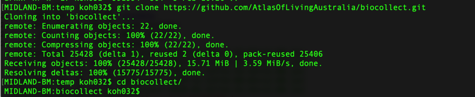
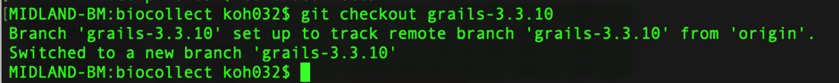
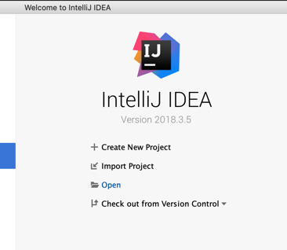
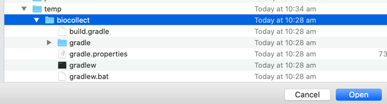
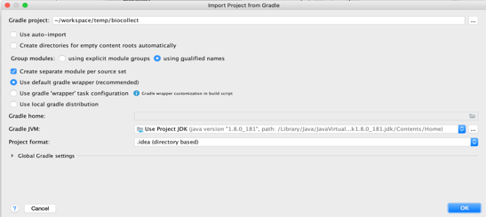
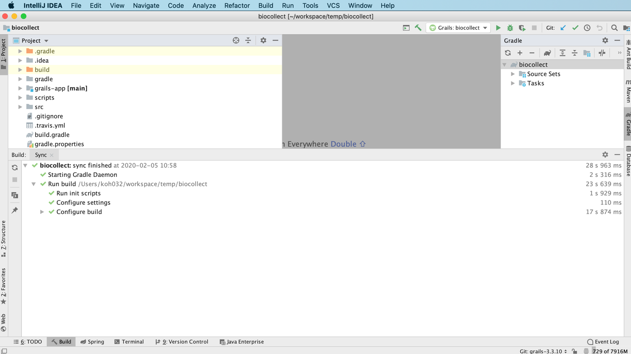
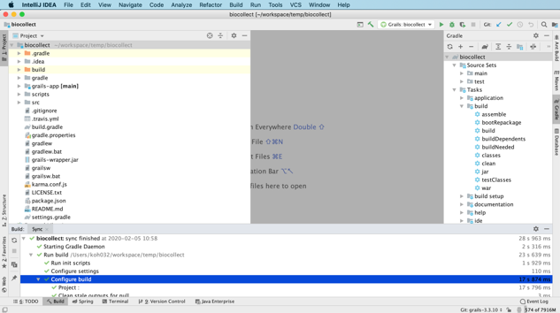
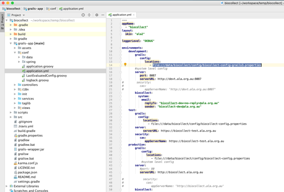
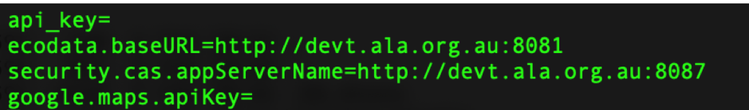

[Back](README.md)

**How to setup BioCollect in IntelliJ**

*  Clone the biocollect project into a directory.


* Checkout the branch you want to work on (e.g. `develop`).


* In Intellij, click Open and navigate to the biocollect folder then
  click on Open.



* The first time when you open the project, you need to Import Project
  from Gradle. The biocollect project comes with the Gradle wrapper
  (Gradle 8.14.4), so keep the default setting and click OK. Make sure
  the project SDK is set to JDK 17 - both the Gradle JVM
  (Settings > Build, Execution, Deployment > Build Tools > Gradle) and
  the Project SDK must be Java 17.


* Once the project opens, wait for Intellij to configure the build.
  You should see the following.



* Before running biocollect, make sure that the following
  properties file exists at
  /data/biocollect/config/biocollect-config.properties (or as indicated in application.yml)


* The minimum config in the properties file looks like this:


* Biocollect by default runs on port 8087 in development mode. 
  Modify application.yml or add server.port in properties file if a different port is required. 
  The security.cas.appServerName and server.serverURL as well if needed.


**Working with the in-place plugin projects**

BioCollect builds against local copies of its two main plugins by default
(`inplace=true` in `gradle.properties`). The conditional includes already
exist in `settings.gradle` - no build file edits are required.

* Clone [ecodata-client-plugin](https://github.com/AtlasOfLivingAustralia/ecodata-client-plugin)
  and [ala-map-plugin](https://github.com/AtlasOfLivingAustralia/ala-map-plugin)
  into the same parent folder as the biocollect project, and check out the
  branch matching the biocollect branch you are working on.

* Re-import / refresh the Gradle project in IntelliJ. Both plugin projects
  will appear as subprojects of the biocollect multi-project build, and
  changes to them are picked up by the running application.

* Run the application with:

```
./gradlew :bootRun -Dgrails.run.active=true
```

  Note the leading colon - it is required in the multi-project build.

* To build against the published plugin artifacts instead (no sibling
  clones required), opt out of the in-place build:

```
./gradlew bootRun -Pinplace=false
```

[Back](README.md)
