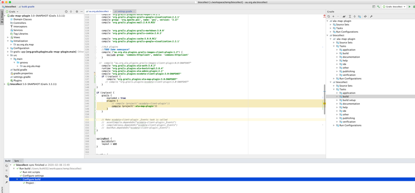

[Back](README.md)

**How to setup Bioollect grails 3 in Intellij**

*  Clone biocollect grails 3 project into a directory.

* Checkout the branch which contain the latest grails3 code.

* In Intellij, click Open and navigate to the biocollect folder then
  click on Open.

* The first time when you open the project, you need to Import Project
  from Gradle. As the biocollect project comes with Gradle wrapper,
  keep the default setting and click OK.

* Once the project opens, wait for Intellij to configure the build.
  You should see the following.

* Before running biocollect grails 3, make sure that the following
  properties file exist in
  /data/biocollect/config/biocollect-config-grails3.properties (or as indicated in application.yml)

* The minimum config in the properties file looks like this:

* Biocollect by default runs on port 8087 in development mode. 
  Modify application.yml or add server.port in properties file if a different port is required. 
  The security.cas.appServerName and server.serverURL as well if needed.

**How to modify plugins in a grails 3 project**

* To modify a plugin project for biocollect, for eg: ala-map-plugin,
  first git clone ala-map-plugin in the same folder where biocollect
  is. Checkout branch where latest grails3 code is.

* In biocollect project, modify settings.gradle and add the following:

* In biocollect project, modify the build.gradle file to set inplace =
  true, then add the inplace plugin

* Make sure dependencies does not include the ala-map-plugin as we have
  inplace plugin project which is part of the build.

* Once the build.gradle is modified, rebuild biocollect project. Once
  the project has a successful build, you should now see
  ala-map-plugin project as well.

[Back](README.md)